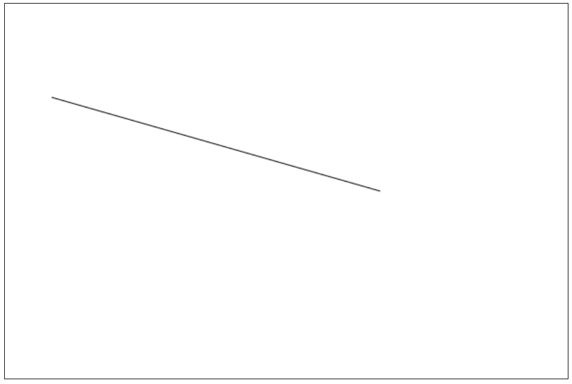
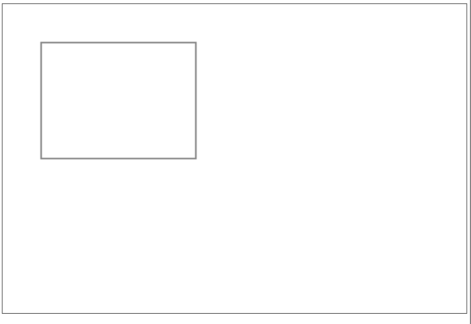
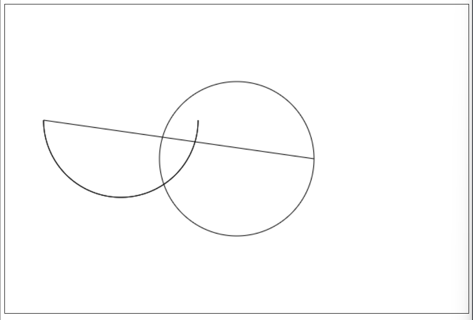
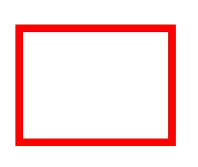
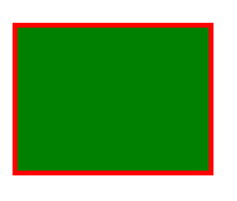
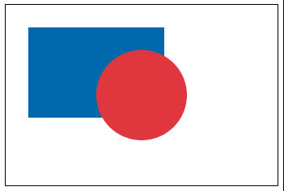
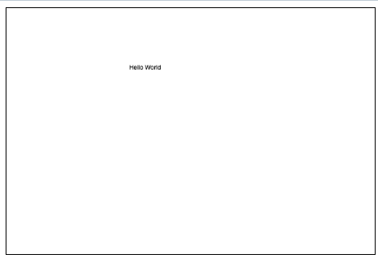
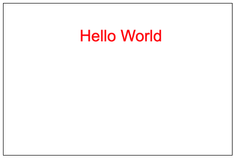
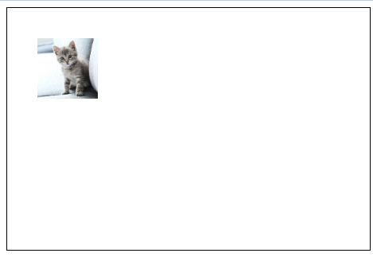
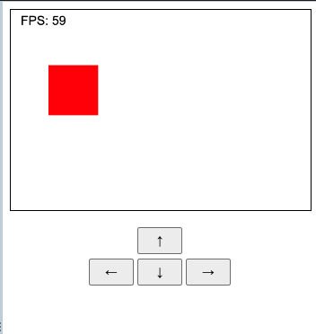

# Desarrollo de Videojuegos con Javascript
Repositorio hecho a base de un curso de SoloLearn

Este repositorio verá la creacion de videojuegos (basico) con HTML, CSS y JS, cuyo mayor beneficio es que, al correr en el navegador, corre en una gran cantidad de dispositivos. Se dará por sentado que se sabe lo basico de los tres. 

### Alinear elementos HTML
A por ejemplo, parrafos en HTML podemos agregarle una alineacion en en sus mismos atributos

```javascript
<p align="center">
<p align="right">
```

### Definir ancho 
El elemento `<hr>` dibuja una linea horizontal en donde esta ubicado. Se puede definir su ancho de la siguiente forma

```javascript
<hr width="50px"/>
```

En este elemento aplican las mismas propiedades de alineamiento vistos en el item anterior. 

### Canvas en HTML
El tag de `<canvas>` se utiliza para dibujar figuras. Para setear un canvas basico se debe:

```javascript
<canvas id="canvas" width="600" height="400">
  Este navegador es muy antiguo
</canvas>
```

El texto dentro del mismo aparece cuando el navegador es demasiado viejo y no soporta HTML5. 

¿Como se hace para dibujar dentro del mismo si el canvas cambia de tamaño dependiendo del tamaño de su contenedor? Se dibuja usando **coordenadas** dentro del canvas. Los dibujos se escalan solos. Por ejemplo, en nuestro canvas, la parte superior izquierda es el punto (0,0) del canvas total. Por ejemplo, si un canvas posee un tamaño de 200x100, el punto del medio del mismo sera el (100, 50), la mitad de ambos valores.

Luego de definir el canvas, es necesario definir el **contexto 2d** del mismo de la siguiente manera en Javascript. El contexto es un objeto con propiedades y funciones que se pueden usar para dibujar. 

```javascript
<script>
// Para hacer esto una vez que la pagina termina de cargar
window.onload = function() {
    // Definimos el canvas por su ID
    canvas = document.getElementById('canvas-ejemplo');
    // Definimos el contexto 2d
    context = canvas.getContext("2d");
};
</script>
```

### Dibujando una linea

  

Ahora que se tiene el canvas preparado, vamos a probar dibujar una linea recta del punto (50,100) al punto (400,200)

Hay 3 funciones.`moveTo()`, `lineTo()` y `stroke()`. 

* **moveTo** define la coordinada en el canvas
* **lineTo** define las coordenadas de fin de la linea
* **stroke** dibuja la linea

```javascript
context.moveTo(50,100);
context.lineTo(400, 200);
context.stroke();
```

### Dibujar un Rectangulo

  

Se puede dibujar un rectangulo con la siguiente funcion:

`context.rect(x, y, width, height);`

X e Y son las coordenadas de comienzo. Si quiero, por ejemplo, dibujar un rectangulo en el punto (50,50) con el tamaño de 200x150, la funcion quedaria asi:

```javascript
context.rect(50,50,200,150);
context.stroke();
```

### Dibujar un Circulo

Para dibujar un circulo necesitaremos estas dos lineas

```javascript
context.arc(centerX, centerY, radius, startingAngle, endingAngle, counterclockwise);  
```

* **centerX** y **centerY** son el centro.
* **Radius** es el radio del circulo
* **startingAngle** y **endingAngle** son el comienzo y fin del circulo en radianes.
* **counterClockwise** es opcional, y especifica si el circulo se va a dibujar en sentido del reloj o no. Por defecto su valor es `false`, es decir, se hace en sentido del reloj.

El siguiente codigo dibujara un medio circulo

```javascript
context.arc(150, 150, 100, 0, 1 * Math.PI);
context.stroke();
```

Y el siguiente codigo dibujara un circulo entero

```javascript
context.arc(300, 200, 100, 0, 2 * Math.PI);
context.stroke();  
```

  

### Estilos

Se puede definir el estilo del dibujo con la funcion `strokeStyle`

```javascript
    context.rect(50, 50, 200, 150);
    context.lineWidth = 10;
    context.strokeStyle = "red";
    context.stroke();
```

  


Si queremos rellenarlo usamos la funcion `fillStyle` de la siguiente manera:

```javascript
context.fillStyle = "green";
context.fill();
```

  

### Dibujar multiples figuras

Para dibujar multiples figuras, se usa la funcion `beginPath()` antes de que se dibuje cada figura.

```javascript
// Cuadrado
context.beginPath();
context.rect(50, 50, 300, 200);
context.fillStyle = "#1775b7";
context.fill();

// Circulo
context.beginPath();
context.arc(300, 200, 100, 0, 2 * Math.PI);
context.fillStyle = "#de4646";
context.fill(); 
```

  

### Renderizar Texto

Para renderizar una linea de texto, se puede usar la siguiente funcion:

```javascript
context.fillText("Hola Mundo", 200, 100); 
```

  

De estas 3 letras, la que tendrá la posicion mas baja en el canvas sera la letra B

```javascript
context.fillText("A", 0, 10);
context.fillText("B", 10, 200);
context.fillText("C", 200, 30);
```

Se puede tambien definir estilos de fuentes

```javascript
context.font = '42px Arial';
context.fillStyle = 'red'; // Le damos color de la misma manera que hacemos con las figuras
context.fillText("Hola Mundo", 200, 100); 
```

  
 
### Agregar imagenes

Primero debemos crear el objeto de imagen en JS, estableciendo la fuente de la misma. 

```javascript
var img = new Image();
img.src = 'https://www.hola.com/imagenes/estar-bien/20201104178485/consejos-gatos-para-principiantes/0-884-859/gatito-m.jpg?filter=w500'; 
```

Y luego, para dibujar la imagen en el contexto, usamos la funcion `drawImage()`

```javascript
context.drawImage(img, x, y, width, height);
```

Img es el objeto que creamos recien en el paso anterior. Width y Heigth son opcionales. 

Si se juntan ambas funciones detalladas, se da como resultado lo siguiente: 

```javascript
var canvas = document.getElementById("canvas");
var context = canvas.getContext("2d");
    
var img = new Image();
img.src = 'https://www.hola.com/imagenes/estar-bien/20201104178485/consejos-gatos-para-principiante0-884-859/gatito-m.jpg?filter=w500';
img.onload = function() {
    context.drawImage(img, 50, 50, 100, 100);
};
```

  

Si quiero renderizar mi imagen muy escalada, es decir, mucho mas grande que su tamaño original, canvas posee un sistema que suaviza las imperfecciones que puede tener una imagen ante este efecto de escalado de más. Esto se puede deshabilitar usando el siguiente comando:

```javascript
context.imageSmoothingEnabled = false;
```

### Animaciones

Ahora mismo cuando dibujamos sobre nuestro canvas, ese dibujo permanece estatico, para que el mismo tenga una animacion, debemos limpiar este canvas y dibujar de vuelta el mismo elemento en su nueva posicion. Para crear una animacion, debemos continuamente dibujar el recorrido en nuestro canvas. 

Para dibujar de manera seguida, debemos usar la funcion `setInterval()` o `setTimeout()` que son usados para llamar a una funcion cada X milisegundos. 

Dibujemos en este caso una **barra de carga rectangular roja**

Por ejemplo, si dibujemos un rectangulo en el canvas

```javascript
var canvas = document.getElementById("canvas");
var context = canvas.getContext("2d");
var x = 0;
var y = 100;

function draw() {
  context.beginPath();
  context.rect(x, y, 100, 100);
  context.fillStyle="red";
  context.fill();
}
```

La funcion `draw()` dibujará un rectangulo en el punto (100;100) de cualquier canvas en donde sea llamado. 
Ahora debemos incrementar el valor de X del punto en donde fue dibujado el rectangulo en un principio cada vez que la funcion `draw()` sea llamada, sumando siempre +10 en cada llamado. 

Ante cierta condicion, donde X sea mayor a 600, resetamos su valor a -100 para que la animacion se repita en loop.

```javascript
function draw() {
  context.beginPath();
  context.rect(x, y, 100, 100);
  context.fillStyle = "red";
  context.fill();

  x += 10;
  if (x >= 600) {
    x = -100
  }
}
```

Ahora llamamos a la funcion `draw()` cada 50 milisegundos con la siguiente funcion:

```javascript
setInterval(draw, 50);
```

Dejando como total este codigo:

```javascript
var canvas = document.getElementById("canvas");
    var context = canvas.getContext("2d");
    var x = 0;
    var y = 100;
    
    function draw() {
        context.beginPath();
        context.rect(x, y, 100, 100);
        context.fillStyle="red";
        context.fill();

        x += 10;
        if (x >= 600) {
            x = -100;
        }
    }
    setInterval(draw, 50);
```

Si queremos que sea un simple rectangulo que se mueve de una punta a la otra (sin continuidad en si mismo como una barra de carga) agregamos la funcion `context.clearRect(0, 0, 600, 400);` para resetear la animacion. (Codigo completo en `9- Animacion Cuadrado`)

Resumiendo todo en pasos, quedaria algo asi:
* Limpiar el canvas, de lo contrario, todas las versiones anteriores de las figuras permaneceran en la misma como pasa en el caso de la barra (Ejemplo 8)
* Dibujar los objetos en su posicion
* Actualizar las posiciones de los elementos basados en la logica
* Repetir el proceso

En la carpeta `10- Rebote pelota` tenemos un ejemplo de una logica un poco mas compleja. 

## Finalmente, hagamos el juego!

La accion de borrar el canvas para dibujar los objetos en su nueva posicion se llama **game loop** en videojuegos. Es el responsable de mover objetos, crear animaciones, etc.., necesita ser ejecutado cada vez que sucede algo en el **game canvas**.

Como se vio anteriormente, se uso la funcion `setInterval()` para repetir una funcion cada X veces, este metodo no es performante, para esto Javascript provee la funcion `window.requestAnimationFrame()` que le avisa al navegador cada vez que se desea hacer un redraw. 

Por ejemplo, nuestra animacion de `Animacion Cuadrado Numero 9` quedaria asi:

```javascript
 var canvas = document.getElementById("canvas");
    var context = canvas.getContext("2d");
    var x = 0;
    var y = 100;
    
    function draw() {
        context.clearRect(0, 0, 600, 400);
        
        context.beginPath();
        context.rect(x, y, 100, 100);
        context.fillStyle="red";
        context.fill();

        x += 10;
        if (x >= 600) {
            x = -100;
        }
        window.requestAnimationFrame(draw);
    }
    draw();
```

Para comenzar con el loop, se debe llamar a la funcion `draw()` apenas termina de renderizarse la pagina. Esta nueva funcion hace que la animacion se vea mucho mas suave. Se puede ver el ejemplo en `11- Animacion Cuadrado New`

### Frame Rate

Cada actualizacion del canvas se llama **frame**, la frecuencia de re-dibujados se mide en **frames por segundo (FPS)**. Se obtendran FPS mas altos en dispositivos mas nuevos, lo que dará a animaciones mucho mas suaves. 

La funcion `window.requestAnimationFrame()` corre a 60 Frames por Segundo (60 FPS). Y la funcion anterior, `setInterval()`, si se usaba con 50 miliseconds, resultaba en una ejecucion de 20 FPS. 

Aun asi, en cada dispositivo, la funcion `requestanimationFrame()` va a darnos distintos valores de FPS, no siempre corre a 60, mas cuando el dispositivo es viejo. 

Para ver un ejemplo de una animacion con FPS dinamicos, hay un ejemplo en `12 - Animacion FPS`

### Deteccion de Coaliciones

Por ejemplo, queremos que el rectangulo pare cuando toque el borde del canvas. La manera es chequeando la posicion de ambos elementos y fijandose si estan colicionando. 

Una manera de chequear esto, es comparando la posicion de elemento con la posicion del borde, que es el width del canvas en si

```javascript
if (x >= 600-100) {
  speed = 0;
} 
```
Se resta 100 del width del canvas porque queremos que el rectangulo pare cuando su costado derecho toque el borde del canvas. Cuando esto se detecta, se setea la velocidad en cero para que el rectangulo pare. 

Podemos ver un ejemplo del rectangulo chocando con el borde del canvas y volviendo para atras y asi sucesivamente en `13- Coalicion` (Roto por el momento)

### Input del Usuario

Se necesita el Input del usuario para controlar el juego. Vamos a hacerlo por paso:

Agreguemos los botones en el HTML 

```javascript
<div align="center">
    <button id="up">↑</button><br />
    <button id="left">←</button>
    <button id="down">↓</button>
    <button id="right">→</button>
</div>
```
Con sus respectivos estilos

```css
 button {
     width:50px;
     height: 30px;
     margin-bottom: 5px;
 }
```

Agregamos la referencia a estos botones en JS, por ejemplo, con el boton derecho

```javascript
let right = document.getElementById('right'); 
```

Vamos a hacerlo de tal manera que, mientras el usuario apreta el boton derecho, mueva el rectangulo para el lado derecho, y cuando ya no esté apretando mas el boton, el mismo se detenga. `dir` nos funcionara como variable de referencia. 

```javascript
right.onmousedown = function() {
  dir = 1;
}
right.onmouseup = function() {
  dir = 0;
}  
```

Las funciones `onmousedown` y `onmouseup` son usados para los botones fisicos de un raton, en caso de pantallas tactiles, hay que usar las funciones `ontouchstart` y `ontouchend`

```javascript
right.ontouchstart = function() {
  dir = 1;
}
right.ontouchend = function() {
  dir = 0;
} 
```

Podemos ver un ejemplo del manejo entero de botones en `14- Controles`, donde no tiene coalicion con los costados del canvas. 

  

